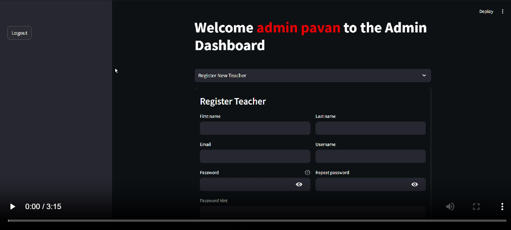

# Online Examination System Using AI

## Introduction

The Online Examination System Using AI is a modern solution for conducting exams online with the help of artificial intelligence. This system ensures a secure and efficient way to manage and monitor exams. AI is used to generate the questions and enhance security.

## Features

- User-friendly interface
- Secure login and authentication
- Admin, Teacher, and Student roles
- Dashboard for monitoring exams and results
- AI-generated questions and answers for the topic and content given
- Automated grading system
- Detailed analytics and reporting

## Installation and Setup

1. Clone the repository:
   ```bash
   git clone https://github.com/pavan347/Online-Examination-System-Using-AI.git
   ```
2. Navigate to the project directory:

    ```bash
    cd Online-Examination-System-Using-AI
    ```

3. Create a virtual environment:

    ```bash
    python -m venv env
    ```

4. Activate the virtual environment:

  - On Windows:
    ```bash
    .\env\Scripts\activate
    ```
  - On macOS and Linux:
    ```bash
    source venv/bin/activate
    ```

5. Install the required dependencies:

    ```bash
    pip install -r requirements.txt
    ```

6. Create a `.env` file in the project directory and add the following environment variables:

   ```env
   export API_KEY=your_gemini_api_key
   ```

7. Create a config.yaml file in the project directory and add the following configuration:

    ```yaml
    cookie:
    expiry_days: 30
    key: some_signature_key
    name: some_cookie_name
    credentials:
    usernames:
      admin:
        email: admin@gmail.com
        failed_login_attempts: 0
        first_name: admin
        last_name: pavan
        logged_in: false
        password: $2b$12$pOXJra5SPJ01tfo2tt/TLu0Mp.ubeHgreGp7spVbWgxBB2Tdp.fsa
        password_hint: admin
        roles:
          - admin
    pre-authorized:
    emails:
      - oesua@gmail.com
    ```

8. The default admin username and password are:

   - Username: `admin`
   - Password: `admin`

9. Start the application:

    ```bash
    streamlit run app.py
    ```

## Contribution

Contributions are welcome! Please fork the repository and create a pull request with your changes. Ensure that your code follows the project's coding standards.

## License

This project is licensed under the MIT License. See the [LICENSE](LICENSE) file for more details.

## Preview

[](OESUA.mp4)

## Contact

For any questions or inquiries, please contact us at [pavankumargarapati@gmail.com](mailto:pavankumargarapati@gmail.com).
